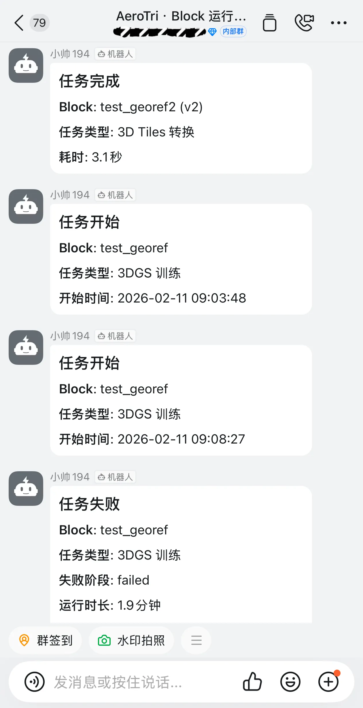
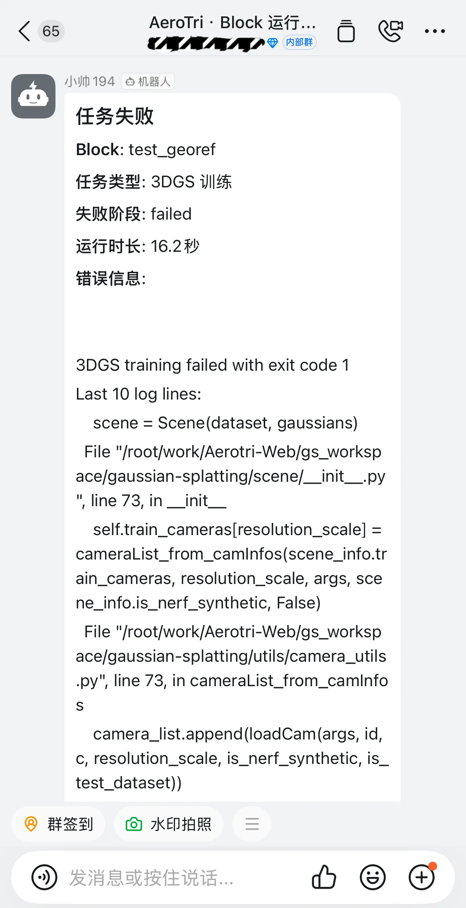
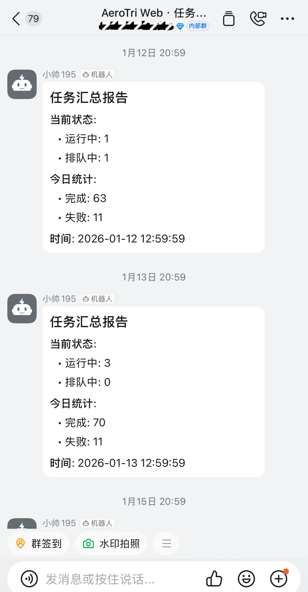
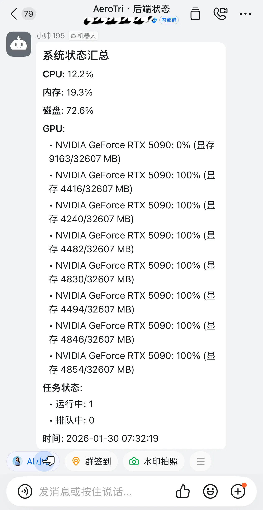
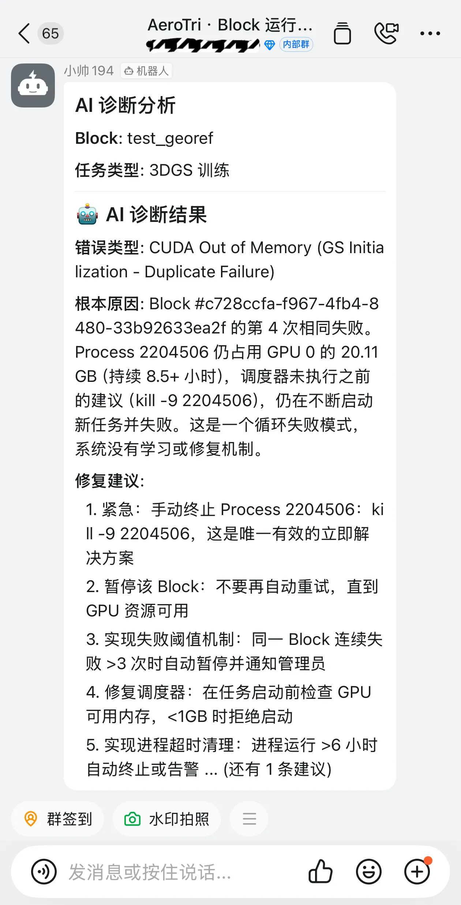

# 🦞 Aerotri-Web

> **AI-Collaborated Photogrammetry Platform** — 首个 AI 协作开发的摄影测量平台

[](LICENSE)
[](https://www.python.org/downloads/)
[](https://vuejs.org/)
[](./docs/06-ai-collaboration/)

Aerotri-Web 是一个基于 Web 的航空摄影测量平台，集成多种 SfM（Structure-from-Motion）算法，支持空中三角测量、密集重建、3D Gaussian Splatting 和 3D Tiles 转换。

## ✨ 核心特性

- **多算法支持**: COLMAP、GLOMAP、InstantSfM、OpenMVG
- **密集重建**: OpenMVS 密集重建、网格重建、纹理映射
- **3D Gaussian Splatting**: 高质量 3D 渲染 + SPZ 压缩（~10x 压缩比）
- **3D Tiles 转换**: 支持 OBJ 转换为 3D Tiles
- **地理参考**: GPS → UTM → ENU 坐标转换，支持真实地理定位
- **智能诊断**: 基于 OpenClaw 的 AI 驱动任务诊断
- **企业通知**: 钉钉/飞书集成，任务状态监控
- **模型对比**: Cesium 分屏同步对比、刷子式对比

## 🎬 演示

- [完整功能演示](https://www.bilibili.com/video/BV17EzQBzEP3/) - 核心功能完整演示
- [模型对比功能演示](https://www.bilibili.com/video/BV1mS6uB3Eyu/) - Block 对比和重建版本对比

## 📱 监控与诊断效果

### 快速预览

**钉钉三通道监控体系**



*任务监控群、运行通知群、后端状态监控群 - 全方位任务状态监控*

**AI 智能诊断**



*任务失败自动触发 AI 诊断，10-30秒后返回详细分析和修复建议*

---

### 详细效果 <Badge type="info">点击展开</Badge>

<details>

<summary>📊 任务监控群 - 周期性汇总</summary>



**功能**: 每日21:00自动发送任务统计报告，包含：
- 统计时间段内的任务总数和成功率
- 各算法类型分布（COLMAP、GLOMAP、InstantSfM、OpenMVG）
- 平均处理时长统计
- 失败任务列表

</details>

<details>

<summary>✅ Block运行通知群 - 任务完成</summary>


**功能**: 任务生命周期实时通知，包含：
- ✅ 任务开始：算法类型、预计耗时
- ✅ 任务完成：处理图像数、耗时、输出统计
- ❌ 任务失败：失败阶段、错误信息、AI诊断结果

</details>

<details>

<summary>🚀 后端状态监控群 - 系统状态</summary>



**功能**: 后端服务和系统资源监控，包含：
- 🚀 后端启动通知：配置路径、数据库位置
- 💻 系统状态监控：CPU、内存、GPU 使用率
- 📊 任务队列状态：等待中和运行中的任务

</details>

<details>

<summary>🤖 AI诊断Agent - 智能分析</summary>



**功能**: 任务失败时自动触发智能诊断：
- 🔍 自动分类错误类型（CUDA OOM、相机模型不兼容等）
- 🎯 分析根本原因（结合日志、参数、系统状态）
- 💡 提供具体修复建议（参数调整、命令操作等）
- 📍 定位相关代码（文件路径和行号）
- 📚 自动更新知识库（持续学习）

**诊断流程**:
```
任务失败 → 即时钉钉通知 → 后台触发AI诊断
                              ↓
                         OpenClaw分析（10-30秒）
                              ↓
                    诊断结果钉钉通知 → 知识库更新
```

</details>

---

📚 **完整配置指南**: [NOTIFICATION_SETUP.md](./docs/NOTIFICATION_SETUP.md#实际效果)

## 🚀 快速开始

### 前置要求

- Python 3.10+
- Node.js 16+
- CUDA 11.0+（可选，用于 GPU 加速）

### 克隆项目

```bash
# 克隆项目（包含子模块）
git clone --recurse-submodules https://github.com/Yangchengshuai/Aerotri-Web.git
cd Aerotri-Web

# 或如果已克隆，手动初始化子模块
git submodule update --init --recursive
```

⚠️ **注意**: 项目依赖多个第三方算法库（COLMAP、OpenMVS、3DGS 等），详见 [安装指南](./docs/02-installation/)。

### 本地开发

**后端**:
```bash
cd aerotri-web/backend
pip install -r requirements.txt
cp config/application.yaml.example config/application.yaml
# 编辑 application.yaml 配置算法路径
uvicorn app.main:app --reload --host 0.0.0.0 --port 8000
```

**前端**:
```bash
cd aerotri-web/frontend
npm install
npm run dev -- --host 0.0.0.0 --port 3000
```

访问 http://localhost:3000

👉 **详细文档**: [快速开始](./docs/01-quickstart/) | [安装指南](./docs/02-installation/)

## 📖 文档

| 文档 | 说明 |
|------|------|
| [快速开始](./docs/01-quickstart/) | 5 分钟快速体验 |
| [安装指南](./docs/02-installation/) | 系统要求和详细安装步骤 |
| [用户指南](./docs/03-user-guide/) | 功能使用说明 |
| [算法文档](./docs/04-algorithms/) | 各算法详解和参数配置 |
| [配置指南](./docs/CONFIGURATION.md) | 完整配置系统说明 |
| [通知配置](./docs/NOTIFICATION_SETUP.md) | 监控和诊断服务配置 |
| [AI 协作](./docs/06-ai-collaboration/) | AI 协作理念和案例 |
| [开发指南](./docs/05-development/) | 架构和开发流程 |
| [贡献指南](./docs/07-contribution/) | 如何参与贡献 |

📚 **完整文档索引**: [docs/README.md](./docs/README.md)

## 🏗️ 系统架构

```
┌─────────────────────────────────────────────────────────┐
│                      Frontend (Vue 3)                    │
│  BlockCard, ReconstructionPanel, ThreeViewer, etc.     │
└────────────────────┬────────────────────────────────────┘
                     │ WebSocket + HTTP
┌────────────────────▼────────────────────────────────────┐
│                   Backend (FastAPI)                      │
│  ┌─────────────┐  ┌─────────────┐  ┌─────────────────┐ │
│  │ task_runner │  │ openmvs_    │  │   gs_runner     │ │
│  │ (SfM)       │  │ runner      │  │ (3DGS Training) │ │
│  └─────────────┘  └─────────────┘  └─────────────────┘ │
└────────────────────┬────────────────────────────────────┘
                     │
┌────────────────────▼────────────────────────────────────┐
│              Algorithms (External Binaries)              │
│  COLMAP | GLOMAP | InstantSfM | OpenMVG | OpenMVS | 3DGS │
└─────────────────────────────────────────────────────────┘
```

👉 **详细架构**: [docs/ARCHITECTURE.md](./docs/ARCHITECTURE.md)

## 🎯 AI 协作亮点

本项目是 **首个 AI-Collaborated Algorithm Engineering 开源项目**，展示了：

- **复利工程效应**: 知识持续积累，形成技术复利
- **苏格拉底提问法**: 提问比答案更重要
- **精准上下文**: 只提供相关信息，避免信息过载
- **可追溯性**: 诊断结果明确关联到具体代码位置
- **AI 团队管理者**: 开发者指挥 AI 而非被替代

👉 [了解 AI 协作经验](./docs/06-ai-collaboration/)

## 🤝 贡献

我们欢迎所有形式的贡献！

1. Fork 本仓库
2. 创建特性分支 (`git checkout -b feature/AmazingFeature`)
3. 提交更改 (`git commit -m 'Add some AmazingFeature'`)
4. 推送到分支 (`git push origin feature/AmazingFeature`)
5. 开启 Pull Request

👉 [贡献指南](./docs/07-contribution/)

## 🙏 致谢

- [COLMAP](https://github.com/colmap/colmap) - Structure-from-Motion and Multi-View Stereo
- [GLOMAP](https://github.com/APRIL-ZJU/GLoMAP) - Global Structure-from-Motion
- [OpenMVG](https://github.com/openMVG/openMVG) - Open Multiple View Geometry
- [InstantSfM](https://github.com/zju3dv/instant-sfm) - Instant Structure-from-Motion
- [OpenMVS](https://github.com/cdcseacave/openmvs) - Open Multi-View Stereo Reconstruction
- [3D Gaussian Splatting](https://github.com/nerfstudio-project/gaussian-splatting) - 3D Gaussian Splatting for Real-Time Rendering
- [OpenClaw](https://github.com/openclaw/openclaw) - Personal AI Assistant
- [Claude Code](https://claude.ai/code) - AI 协作开发工具

## 📄 许可证

本项目采用 [MIT 许可证](LICENSE)。

## 📮 联系方式

- 问题反馈: [GitHub Issues](https://github.com/Yangchengshuai/Aerotri-Web/issues)
- 功能建议: [GitHub Discussions](https://github.com/Yangchengshuai/Aerotri-Web/discussions)
- 邮件: yyccssyyds@gmail.com

---

**用 ❤️ 和 AI 协作开发**
