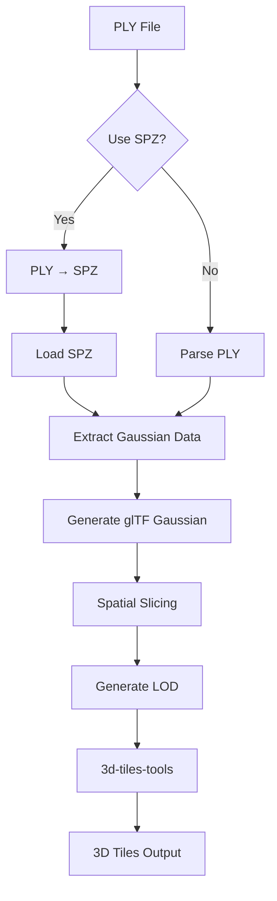

# 3DGS → 3D Tiles 转换工具集成 PRD

## 文档信息

- **版本**: v1.0
- **创建日期**: 2025-01-XX
- **最后更新**: 2025-01-XX
- **状态**: 待评审

---

## 1. 产品概述

### 1.1 背景

当前系统已实现 3DGS 训练的完整流程，训练输出为 PLY 格式文件（500MB - 2GB）。现有 Visionary 预览方案存在以下问题：

- 需要完整下载 PLY 文件才能预览（2-25 分钟）
- 无进度显示（下载阶段 0% 卡住）
- 内存占用大（完整文件加载）
- 不支持 LOD 和流式加载

### 1.2 目标

集成实际转换工具，将 3DGS PLY 文件转换为 3D Tiles 格式，实现：
- **流式加载**：按需加载可见区域，初始加载时间 < 30 秒
- **SPZ 压缩支持**：可选压缩，体积减少约 90%
- **私有化部署**：不依赖 Cesium Ion，完全自托管
- **无缝集成**：与现有 OBJ/倾斜摄影 3D Tiles 架构一致

### 1.3 成功指标

- 转换成功率 > 99%
- 转换时间：iteration_7000 (765MB) < 5 分钟，iteration_15000 (1.9GB) < 10 分钟
- SPZ 压缩后体积减少 > 80%
- 初始加载时间比 Visionary 快 80% 以上

---

## 2. 多角色讨论纪要

### 2.1 产品经理（PM）视角

**需求优先级**：
1. **P0（必须）**：基础转换流程（PLY → glTF → 3D Tiles）
2. **P1（重要）**：SPZ 压缩支持（作为可选优化）
3. **P2（优化）**：LOD 分层、性能优化

**用户价值**：
- 大幅提升预览体验（从分钟级到秒级）
- 降低存储和带宽成本（SPZ 压缩）
- 支持大规模场景（通过 LOD）

**约束条件**：
- 必须私有化部署（不能依赖 Cesium Ion）
- 转换过程不能阻塞训练流程（异步处理）
- 需要支持取消和重试

### 2.2 算法专家视角

**技术方案选择**：

**方案 A：完整流水线（PLY → SPZ → glTF → 3D Tiles）**
- 优点：体积最小，性能最优
- 缺点：工具链复杂，调试困难

**方案 B：基础流水线 + SPZ 可选（PLY → glTF → 3D Tiles，可选 SPZ 压缩）**
- 优点：分阶段实施，风险可控
- 缺点：需要两次转换（如果启用 SPZ）

**决策**：采用方案 B，分阶段实施

**关键技术点**：
1. **坐标系统转换**：PLY (RDF) → SPZ (RUB) → glTF (LUF)
2. **空间切片策略**：Octree 或 BVH，以 splat centroid 为索引
3. **LOD 生成**：基于 splat 密度和重要性下采样
4. **SPZ 压缩**：使用 Niantic 开源库，90% 体积减少

### 2.3 高级后端开发工程师视角

**架构设计**：

```
[gs_tiles_runner.py]
    ├── Stage 1: PLY → SPZ (可选)
    │   └── 使用 spz Python bindings
    ├── Stage 2: PLY/SPZ → glTF Gaussian
    │   └── 使用 KHR_gaussian_splatting 扩展
    └── Stage 3: glTF → 3D Tiles
        └── 使用 3d-tiles-tools
```

**实现要点**：
1. **SPZ 集成**：从源码编译，作为 Python 包安装
2. **错误处理**：每个阶段独立错误处理，支持断点续传
3. **进度跟踪**：按阶段报告进度（0-30% PLY处理，30-70% glTF转换，70-100% 3D Tiles）
4. **资源管理**：大文件处理时控制内存占用

**依赖管理**：
- SPZ 库：从 `/root/work/CesiumGS/spz` 源码编译
- 3d-tiles-tools：已通过 npm 全局安装
- glTF 生成：需要实现或集成 KHR_gaussian_splatting 支持

### 2.4 高级前端算法工程师视角

**前端集成**：

**当前状态**：
- CesiumViewer 组件已实现
- 3D Tiles 加载和进度跟踪已实现
- 需要验证实际转换后的 tileset 加载

**优化建议**：
1. **加载策略**：初始只加载根节点，按需加载子瓦片
2. **性能监控**：记录加载时间、内存占用、帧率
3. **错误处理**：tileset 加载失败时的降级方案
4. **用户体验**：清晰的进度显示和错误提示

**测试策略**：
- 使用实际数据（iteration_7000, iteration_15000）测试
- 对比 Visionary 和 Cesium 方案的性能
- 验证不同文件大小的加载表现

---

## 3. 功能需求

### 3.1 核心功能

#### F1: PLY → glTF Gaussian 转换

**输入**：
- PLY 文件路径（标准 3DGS 格式）
- 可选：SPZ 压缩标志

**处理流程**：
1. 读取 PLY 文件（如果启用 SPZ，先转换为 SPZ）
2. 解析 Gaussian 属性（position, rotation, scale, color, alpha, SH）
3. 生成 glTF 2.0 文件，使用 `KHR_gaussian_splatting` 扩展
4. 验证 glTF 文件有效性

**输出**：
- glTF/GLB 文件
- 转换统计信息（splat 数量、文件大小、耗时）

#### F2: glTF → 3D Tiles 转换

**输入**：
- glTF/GLB 文件路径
- 切片参数（tile size, LOD levels）

**处理流程**：
1. 空间切片（Octree 或 BVH）
2. 生成 LOD 层级
3. 使用 `3d-tiles-tools` 转换为 B3DM
4. 生成 `tileset.json`

**输出**：
- 3D Tiles 目录结构
- `tileset.json` 文件

#### F3: SPZ 压缩支持

**输入**：
- PLY 文件路径
- 压缩选项（坐标系统转换）

**处理流程**：
1. 使用 SPZ Python bindings 加载 PLY
2. 应用压缩（固定点量化、对数编码）
3. 保存为 SPZ 格式

**输出**：
- SPZ 文件（体积减少约 90%）

### 3.2 非功能需求

#### N1: 性能要求
- 转换时间：iteration_7000 < 5 分钟，iteration_15000 < 10 分钟
- 内存占用：< 4GB（处理 2GB PLY 文件时）
- CPU 使用：支持多核并行处理

#### N2: 可靠性要求
- 转换成功率 > 99%
- 支持断点续传（失败后可从中间阶段重试）
- 完善的错误日志和诊断信息

#### N3: 可维护性要求
- 模块化设计，每个阶段独立可测试
- 详细的日志记录
- 清晰的错误信息

---

## 4. 技术方案

### 4.1 转换流水线



### 4.2 SPZ 集成方案

**方案**：从源码编译集成

**步骤**：
1. 在 `backend/` 目录下创建 `third_party/spz/` 目录
2. 复制或链接 `/root/work/CesiumGS/spz` 源码
3. 使用 CMake 编译 C++ 库
4. 使用 scikit-build 编译 Python bindings
5. 安装为项目依赖

**依赖**：
- CMake >= 3.10
- C++17 编译器
- zlib
- Python >= 3.8
- nanobind >= 1.3.2

### 4.3 glTF Gaussian 生成

**方案**：实现 KHR_gaussian_splatting 扩展支持

**关键点**：
- 使用 `KHR_gaussian_splatting` 扩展定义
- 正确设置 attributes（position, rotation, scale, color, alpha, SH）
- 坐标系统转换（PLY RDF → glTF LUF）

**工具选择**：
- 自实现 glTF 生成器（基于 glTF 2.0 规范）
- 或使用社区工具（如 `ply-to-gltf-gaussian`）

### 4.4 3D Tiles 切片策略

**空间划分**：
- 使用 Octree 或 BVH
- 以 splat centroid 为索引
- 每个 tile 包含固定数量的 splats（如 100K）

**LOD 生成**：
- L0：全量 splats
- L1：50% 下采样
- L2：25% 下采样

**工具**：
- 使用 `3d-tiles-tools` 的 `glbToB3dm` 和 `createTilesetJson`

---

## 5. API 设计

### 5.1 转换请求

```python
POST /api/blocks/{block_id}/gs/tiles/convert

Request Body:
{
    "iteration": 7000,           # 可选，指定迭代版本
    "use_spz": false,            # 是否使用 SPZ 压缩
    "optimize": false            # 是否优化（未来使用）
}
```

### 5.2 状态查询

```python
GET /api/blocks/{block_id}/gs/tiles/status

Response:
{
    "block_id": "...",
    "gs_tiles_status": "RUNNING",  # NOT_STARTED | RUNNING | COMPLETED | FAILED | CANCELLED
    "gs_tiles_progress": 45.5,     # 0-100
    "gs_tiles_current_stage": "生成 glTF Gaussian",
    "gs_tiles_output_path": "/path/to/output",
    "gs_tiles_error_message": null,
    "gs_tiles_statistics": {
        "input_file_size_mb": 764.08,
        "output_file_size_mb": 76.4,
        "compression_ratio": 10.0,
        "splat_count": 1000000,
        "tile_count": 10,
        "conversion_time_seconds": 180
    }
}
```

---

## 6. 实施计划

### 6.1 阶段 1：SPZ 库集成（1-2 天）

**任务**：
1. 设置 SPZ 源码编译环境
2. 编译 C++ 库和 Python bindings
3. 集成到项目依赖
4. 编写单元测试验证 SPZ 加载/保存

**验收标准**：
- SPZ 库可成功编译
- Python bindings 可正常导入
- 可成功加载和保存 SPZ 文件

### 6.2 阶段 2：PLY → glTF 转换（3-5 天）

**任务**：
1. 实现 PLY 文件解析
2. 实现 glTF Gaussian 生成器
3. 实现 KHR_gaussian_splatting 扩展支持
4. 实现坐标系统转换
5. 集成 SPZ 压缩（可选路径）

**验收标准**：
- 可成功将 PLY 转换为 glTF
- glTF 文件符合 KHR_gaussian_splatting 规范
- Cesium 可加载生成的 glTF（验证）

### 6.3 阶段 3：glTF → 3D Tiles 转换（2-3 天）

**任务**：
1. 实现空间切片算法（Octree/BVH）
2. 实现 LOD 生成
3. 集成 3d-tiles-tools
4. 生成 tileset.json

**验收标准**：
- 可成功将 glTF 转换为 3D Tiles
- tileset.json 结构正确
- Cesium 可加载 tileset

### 6.4 阶段 4：集成测试和优化（2-3 天）

**任务**：
1. 端到端测试（使用实际数据）
2. 性能优化
3. 错误处理完善
4. 文档更新

**验收标准**：
- 所有测试用例通过
- 性能指标达标
- 错误处理完善

---

## 7. 风险和缓解

| 风险 | 影响 | 概率 | 缓解措施 |
|------|------|------|----------|
| SPZ 编译失败 | 高 | 中 | 提供详细的编译文档，支持 Docker 环境 |
| glTF 扩展不兼容 | 高 | 低 | 固定 Cesium 版本，充分测试 |
| 转换时间过长 | 中 | 中 | 优化算法，支持并行处理 |
| 内存占用过大 | 中 | 中 | 流式处理，分块加载 |
| 工具链依赖复杂 | 中 | 高 | 提供 Docker 镜像，文档化依赖 |

---

## 8. 后续优化

- **LOD 优化**：更智能的 LOD 生成策略
- **并行处理**：多文件并行转换
- **缓存机制**：转换结果缓存，避免重复转换
- **增量更新**：支持增量转换（仅转换变更部分）

---

## 9. 附录

### 9.1 参考文档

- [3DGS → Cesium 私有化切片工程流水线设计](3_dgs_→_cesium_私有化切片工程流水线设计.md)
- [SPZ 格式文档](https://github.com/nianticlabs/spz)
- [KHR_gaussian_splatting 扩展](https://github.com/KhronosGroup/glTF/tree/main/extensions/2.0/Khronos/KHR_gaussian_splatting)
- [3D Tiles 规范](https://github.com/CesiumGS/3d-tiles)

### 9.2 测试数据

- `iteration_7000/point_cloud.ply` - 765MB（中等大小，快速测试）
- `iteration_15000/point_cloud.ply` - 1.9GB（完整模型，性能测试）

---

**文档状态**: ✅ 待开发团队评审
