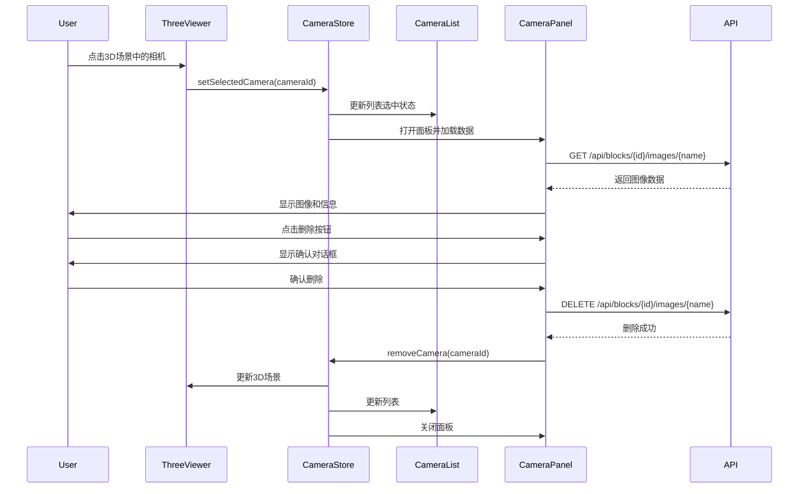

# PRD: 相机选择与异常图像管理功能

## 1. 产品概述

### 1.1 背景
在空三重建完成后，用户需要在3D视图中检查相机位姿，识别异常相机（如位置偏移、角度异常等），并能够查看对应的图像以确认是否为异常图像（如颜色异常、曝光问题等），进而删除这些异常图像，重新进行空三重建以提高重建质量。

### 1.2 目标
- 提供直观的相机选择交互（3D场景点击 + 侧边栏列表）
- 选中相机后显示对应图像，便于用户判断是否为异常图像
- 支持删除异常图像，为重新空三做准备
- 为后续扩展（重投影误差显示）预留接口

### 1.3 用户价值
- **提高效率**：快速定位和检查异常相机，无需手动查找图像文件
- **提升质量**：及时剔除异常图像，提高重建精度
- **降低门槛**：可视化操作，降低技术门槛

## 2. 功能需求

### 2.1 相机选择功能

#### 2.1.1 3D场景点击选择
- **交互方式**：用户点击3D场景中的相机对象（frustum）
- **视觉反馈**：
  - 选中相机高亮显示（改变颜色或添加边框）
  - 未选中相机恢复默认样式
  - 支持多选（可选，建议先实现单选）
- **技术实现**：使用Three.js Raycaster进行点击检测

#### 2.1.2 侧边栏相机列表
- **位置**：左侧边栏，位于"图像预览"区域下方或新增"相机列表"区域
- **功能**：
  - 显示所有相机列表（相机ID、图像名称）
  - 支持搜索/过滤
  - 点击列表项选中对应相机
  - 高亮当前选中项
- **数据展示**：
  - 相机ID（image_id）
  - 图像名称（image_name）
  - 可选：3D点数量（num_points）
  - 可选：相机位置坐标（x, y, z）

### 2.2 图像显示功能

#### 2.2.1 底部面板设计
- **位置**：主视图底部，可展开/收起
- **展开方式**：
  - 选中相机时自动展开
  - 手动点击展开/收起按钮
  - 支持拖拽调整面板高度
- **面板内容**：
  - **图像预览区**：
    - 显示选中相机对应的原始图像
    - 支持缩放（鼠标滚轮或按钮）
    - 支持全屏查看
    - 显示图像文件名
  - **相机信息区**：
    - 相机ID
    - 图像名称
    - 相机位置（x, y, z）
    - 相机姿态（四元数或欧拉角）
    - 关联的3D点数量
  - **操作按钮区**：
    - "删除图像"按钮（带确认对话框）
    - "查看原图"按钮（新窗口打开）
    - "关闭"按钮（收起面板）

#### 2.2.2 图像加载
- 使用现有API：`GET /api/blocks/{block_id}/images/{image_name}`
- 支持加载状态显示
- 支持加载失败提示

### 2.3 图像删除功能

#### 2.3.1 删除操作流程
1. 用户在底部面板点击"删除图像"按钮
2. 弹出确认对话框：
   - 显示图像名称
   - 警告信息："删除后需要重新运行空三才能生效"
   - "确认"和"取消"按钮
3. 确认后调用删除API
4. 删除成功后：
   - 更新相机列表（移除已删除的相机）
   - 更新3D场景（移除已删除的相机对象）
   - 收起底部面板
   - 显示成功提示

#### 2.3.2 删除限制
- 仅当Block状态为`completed`或`failed`时允许删除
- 删除后Block状态应标记为需要重新运行（可选：自动将状态改为`pending`）
- 删除后需要重新运行空三才能看到效果

#### 2.3.3 技术实现
- 使用现有API：`DELETE /api/blocks/{block_id}/images/{image_name}`
- 前端需要同步更新本地状态

### 2.4 状态同步

#### 2.4.1 相机列表与3D场景同步
- 3D场景点击选中 → 更新侧边栏列表选中状态
- 侧边栏列表点击 → 更新3D场景相机高亮
- 相机删除 → 同时更新列表和场景

#### 2.4.2 数据一致性
- 删除图像后，相机数据需要从COLMAP结果中移除（或标记为无效）
- 考虑：删除后是否需要重新读取相机数据，还是仅从前端移除？

## 3. 技术设计

### 3.1 前端架构

#### 3.1.1 组件结构
```
BlockDetailView.vue
├── ThreeViewer.vue (3D场景)
│   └── 相机点击事件处理
├── CameraList.vue (侧边栏相机列表) [新增]
│   └── 列表项点击事件
└── CameraDetailPanel.vue (底部面板) [新增]
    ├── ImageViewer.vue (图像预览)
    ├── CameraInfo.vue (相机信息)
    └── ActionButtons.vue (操作按钮)
```

#### 3.1.2 状态管理
- 使用Pinia store管理选中相机状态
- Store结构：
  ```typescript
  interface CameraSelectionState {
    selectedCameraId: number | null
    selectedImageName: string | null
    cameras: CameraInfo[]
    isPanelOpen: boolean
  }
  ```

#### 3.1.3 Three.js交互
- 在`useThreeViewer.ts`中添加点击事件监听
- 使用Raycaster检测相机对象点击
- 点击后触发选中事件，更新store

### 3.2 后端架构

#### 3.2.1 API设计
- **获取相机列表**（已存在）：`GET /api/blocks/{block_id}/result/cameras`
- **获取图像**（已存在）：`GET /api/blocks/{block_id}/images/{image_name}`
- **删除图像**（已存在）：`DELETE /api/blocks/{block_id}/images/{image_name}`
- **获取相机详细信息**（可选，新增）：
  - `GET /api/blocks/{block_id}/result/cameras/{image_id}`
  - 返回单个相机的详细信息，包括重投影误差等（为后续扩展预留）

#### 3.2.2 数据模型
- 无需修改数据库模型
- CameraInfo schema已包含所需字段：
  - `image_id`: 相机ID
  - `image_name`: 图像名称
  - `x, y, z`: 相机位置（可选）
  - `num_points`: 关联点数量

#### 3.2.3 删除逻辑增强
- 当前删除API仅删除文件
- 考虑：删除后是否需要更新COLMAP结果文件？
  - 方案1：仅删除文件，重新运行空三时自动排除
  - 方案2：删除文件 + 更新COLMAP结果（复杂，建议方案1）

### 3.3 数据流设计



## 4. UI/UX设计

### 4.1 视觉设计原则
- **一致性**：遵循现有Element Plus设计规范
- **清晰性**：选中状态明显，操作按钮明确
- **响应性**：操作即时反馈，加载状态明确

### 4.2 交互细节

#### 4.2.1 相机高亮
- **选中颜色**：使用主题色（如蓝色 #409EFF）
- **高亮方式**：改变相机frustum颜色或添加外边框
- **过渡动画**：0.2s平滑过渡

#### 4.2.2 底部面板
- **默认高度**：300px（可调整）
- **最小高度**：200px
- **最大高度**：视口高度的60%
- **展开动画**：从底部滑入，0.3s
- **拖拽手柄**：顶部显示拖拽条

#### 4.2.3 图像预览
- **显示模式**：
  - 适应容器（默认）
  - 原始尺寸
  - 缩放控制（+/-按钮或滚轮）
- **加载状态**：显示加载动画
- **错误状态**：显示错误图标和提示

### 4.3 响应式设计
- 小屏幕：底部面板全屏显示
- 大屏幕：底部面板部分显示，不影响3D视图

## 5. 扩展性设计

### 5.1 重投影误差显示（后续版本）
- 在CameraInfo schema中添加误差字段
- 在底部面板中添加"误差统计"标签页
- 显示：
  - 平均重投影误差
  - 最大重投影误差
  - 误差分布图表
  - 误差点云可视化（在3D场景中）

### 5.2 批量操作（后续版本）
- 支持多选相机
- 批量删除
- 批量导出图像列表

### 5.3 异常检测（后续版本）
- 自动检测异常相机（基于位置、角度、误差等）
- 异常相机自动高亮
- 异常原因提示

## 6. 测试计划

### 6.1 功能测试
- [ ] 3D场景点击选择相机
- [ ] 侧边栏列表选择相机
- [ ] 选中状态同步
- [ ] 图像加载和显示
- [ ] 图像删除功能
- [ ] 删除后状态更新
- [ ] 面板展开/收起
- [ ] 面板拖拽调整

### 6.2 边界测试
- [ ] 无相机数据时的处理
- [ ] 图像文件不存在时的处理
- [ ] 删除失败时的错误处理
- [ ] 网络错误时的处理
- [ ] 大量相机时的性能测试

### 6.3 兼容性测试
- [ ] 不同浏览器兼容性
- [ ] 不同屏幕尺寸适配
- [ ] 分区模式下的兼容性
- [ ] 版本切换时的兼容性

## 7. 开发优先级

### Phase 1: 核心功能（MVP）
1. 3D场景相机点击选择
2. 底部面板显示选中相机图像
3. 图像删除功能

### Phase 2: 增强体验
1. 侧边栏相机列表
2. 面板拖拽调整
3. 图像缩放功能

### Phase 3: 扩展功能
1. 重投影误差显示
2. 批量操作
3. 异常检测

## 8. 风险评估

### 8.1 技术风险
- **Three.js交互**：点击检测可能受相机大小影响，需要调整raycast参数
- **性能问题**：大量相机时，列表渲染和3D场景更新可能较慢
  - 缓解：虚拟滚动、按需加载

### 8.2 用户体验风险
- **误操作**：删除图像不可恢复
  - 缓解：确认对话框、操作日志
- **学习成本**：新功能需要用户学习
  - 缓解：直观的UI设计、操作提示

## 9. 成功指标

- 用户能够快速定位异常相机（< 10秒）
- 图像加载时间 < 2秒
- 删除操作成功率 > 99%
- 用户满意度 > 4/5

