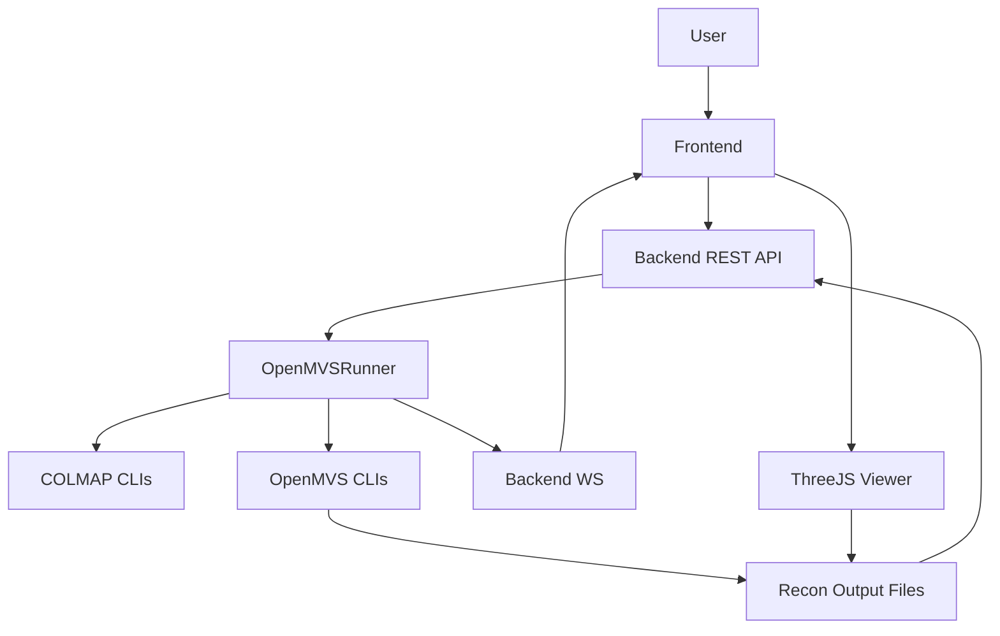

## 文档信息

- **文档名称**: AeroTri Web 重建模块（OpenMVS）开发设计文档
- **版本**: v0.1
- **关联 PRD**: `docs/openmvs_reconstruction_prd.md`
- **作者**: （待填）
- **最后更新**: （待填）

## 1. 总体架构设计

### 1.1 模块边界

- **后端 Backend**
  - 扩展 Block 模型以支持重建状态与输出。
  - 新增 `OpenMVSRunner` 执行器，负责从 SfM 结果到纹理 Mesh 的整个 CLI 调用流程。
  - 扩展 API（REST + WebSocket）以支持：
    - 触发重建任务
    - 查询重建状态
    - 列出/下载重建输出文件
    - 推送重建进度与日志摘要
- **前端 Frontend**
  - 在 Block 详情页增加“重建（Reconstruction）”面板。
  - 实现基础 3D 预览组件（基于 Three.js），加载后端提供的资源 URL。
- **OpenMVS 子系统**
  - 通过配置或环境变量获取各二进制路径。
  - CLI 调用参数从预设（quality_preset）映射到具体 OpenMVS 参数。

### 1.2 数据与流程总览



## 2. 后端设计（Backend）

### 2.1 Block 模型扩展

文件：`backend/app/models/block.py`（示例字段，具体以 ORM 为准）

新增字段建议：

```python
class Block(Base):
    # 现有字段略 …

    class ReconStatus(str, enum.Enum):
        NOT_STARTED = "NOT_STARTED"
        RUNNING = "RUNNING"
        COMPLETED = "COMPLETED"
        FAILED = "FAILED"
        CANCELLED = "CANCELLED"

    recon_status: Mapped[Optional[str]] = mapped_column(default="NOT_STARTED")
    recon_progress: Mapped[Optional[float]] = mapped_column(default=0.0)
    recon_current_stage: Mapped[Optional[str]] = mapped_column(nullable=True)
    recon_output_path: Mapped[Optional[str]] = mapped_column(nullable=True)
    recon_error_message: Mapped[Optional[str]] = mapped_column(nullable=True)
    recon_statistics: Mapped[Optional[dict]] = mapped_column(JSON, nullable=True)
```

`schemas.py` 中 Block 响应模型同步扩展这些字段。

### 2.2 配置与环境变量

推荐在 `backend/app/main.py` 或单独 `settings` 模块中集中配置：

```python
OPENMVS_BIN_DIR = os.getenv("OPENMVS_BIN_DIR", "/root/work/openMVS/build_cuda/bin")
OPENMVS_INTERFACE_COLMAP = os.getenv(
    "OPENMVS_INTERFACE_COLMAP_PATH",
    os.path.join(OPENMVS_BIN_DIR, "InterfaceCOLMAP"),
)
OPENMVS_DENSIFY = os.getenv(
    "OPENMVS_DENSIFY_PATH",
    os.path.join(OPENMVS_BIN_DIR, "DensifyPointCloud"),
)
OPENMVS_RECONSTRUCT = os.getenv(
    "OPENMVS_RECONSTRUCT_PATH",
    os.path.join(OPENMVS_BIN_DIR, "ReconstructMesh"),
)
OPENMVS_REFINE = os.getenv(
    "OPENMVS_REFINE_PATH",
    os.path.join(OPENMVS_BIN_DIR, "RefineMesh"),
)
OPENMVS_TEXTURE = os.getenv(
    "OPENMVS_TEXTURE_PATH",
    os.path.join(OPENMVS_BIN_DIR, "TextureMesh"),
)
```

COLMAP 继续复用已有 `COLMAP_PATH`。

### 2.3 OpenMVSRunner 设计

新文件建议：`backend/app/services/openmvs_runner.py`

核心职责：

- 入口：

```python
async def start_reconstruction(
    self, block: Block, gpu_index: int, db: AsyncSession, quality_preset: str
):
    ...
```

- 负责构建 `recon` 输出目录结构、更新 Block 重建状态、依次调用各阶段 CLI，并记录阶段耗时与输出文件信息。

示意伪代码：

```python
class OpenMVSRunner:
    async def start_reconstruction(self, block, gpu_index, db, quality_preset):
        recon_dir = os.path.join(block.output_path, "recon")
        dense_dir = os.path.join(recon_dir, "dense")
        mesh_dir = os.path.join(recon_dir, "mesh")
        refine_dir = os.path.join(recon_dir, "refine")
        texture_dir = os.path.join(recon_dir, "texture")

        block.recon_status = ReconStatus.RUNNING.value
        block.recon_current_stage = "initializing"
        block.recon_progress = 0.0
        block.recon_output_path = recon_dir
        await db.commit()

        await self._run_undistort(...)
        await self._run_interface_colmap(...)
        await self._run_densify(...)
        await self._run_mesh(...)
        await self._run_refine(...)
        await self._run_texture(...)

        block.recon_status = ReconStatus.COMPLETED.value
        block.recon_current_stage = "completed"
        block.recon_progress = 100.0
        block.recon_statistics = {...}
        await db.commit()
```

#### 2.3.1 阶段与参数映射

quality preset → OpenMVS 参数映射示例：

```python
QUALITY_PRESETS = {
    "fast": {
        "reconstruct_decimate": 0.3,
        "reconstruct_thickness": 1.0,
        "refine_resolution_level": 2,
        "refine_max_face_area": 256,
    },
    "balanced": {
        "reconstruct_decimate": 0.5,
        "reconstruct_thickness": 1.5,
        "refine_resolution_level": 1,
        "refine_max_face_area": 128,
    },
    "high": {
        "reconstruct_decimate": 0.7,
        "reconstruct_thickness": 1.5,
        "refine_resolution_level": 0,
        "refine_max_face_area": 64,
    },
}
```

各阶段 CLI 与 `data/test_openmvs_pipeline.sh` 对齐（此处只给出格式，具体实现时按脚本细节编写）：

1）COLMAP 去畸变（image_undistorter）  
2）InterfaceCOLMAP  
3）DensifyPointCloud  
4）ReconstructMesh  
5）RefineMesh  
6）TextureMesh

#### 2.3.2 与 TaskRunner 关系

- 可复用现有 `TaskRunner._run_process` 思路：  
  - 异步子进程执行  
  - 逐行读取日志并写入 `run_recon.log`  
  - 解析进度并通过 WebSocket 推送  
- 为了解耦，建议在 `OpenMVSRunner` 内部封装一个简单的 `_run_process`，接口与 `TaskRunner` 接近，便于未来抽取为共享工具类。

### 2.4 API 层实现

文件：`backend/app/api/blocks.py` 或新增 `reconstruction.py`

#### 2.4.1 触发重建

路由示例：

```python
@router.post("/blocks/{block_id}/reconstruct")
async def start_reconstruct(
    block_id: str,
    payload: ReconstructRequest,
    db: AsyncSession = Depends(get_db),
):
    ...
```

请求模型：

```python
class ReconstructRequest(BaseModel):
    quality_preset: Literal["fast", "balanced", "high"] = "balanced"
```

关键逻辑：

- 校验 Block 存在且 SfM 已完成（`status == COMPLETED`）。
- 若 `recon_status == RUNNING`，返回 409 或直接返回当前状态。
- 取用 GPU index（沿用空三时的 GPU）。
- 启动 `OpenMVSRunner.start_reconstruction` 异步任务。

#### 2.4.2 查询状态 / 文件列表 / 下载

- 状态：

```python
@router.get(
    "/blocks/{block_id}/reconstruction/status",
    response_model=ReconstructionStatusResponse,
)
async def get_recon_status(...):
    ...
```

- 文件列表：

```python
@router.get(
    "/blocks/{block_id}/reconstruction/files",
    response_model=ReconstructionFilesResponse,
)
async def list_recon_files(...):
    # 遍历 recon_dir 下子目录, 收集文件信息
```

- 下载：

```python
@router.get("/blocks/{block_id}/reconstruction/download")
async def download_recon_file(block_id: str, file: str, ...):
    # 校验 file 在该 block 的 recon 目录下后返回 FileResponse
```

### 2.5 WebSocket 扩展

文件：`backend/app/ws/progress.py`

- 复用 `/ws/blocks/{id}/progress`，在数据中增加 `pipeline` 字段：

```python
await ws.send_json(
    {
        "pipeline": "reconstruction",
        "stage": stage_name,
        "progress": progress_value,
        "message": msg,
    }
)
```

前端根据 `pipeline` 判断是 SfM 还是重建进度。

## 3. 前端设计（Frontend）

### 3.1 API 封装

文件：`frontend/src/api/blocks.ts`（示例）

```ts
export function startReconstruction(blockId: string, preset: string) {
  return http.post(`/api/blocks/${blockId}/reconstruct`, {
    quality_preset: preset,
  });
}

export function getReconstructionStatus(blockId: string) {
  return http.get(`/api/blocks/${blockId}/reconstruction/status`);
}

export function getReconstructionFiles(blockId: string) {
  return http.get(`/api/blocks/${blockId}/reconstruction/files`);
}
```

### 3.2 Store 状态扩展

文件：`frontend/src/stores/blocks.ts`（示例接口）

```ts
interface ReconFileInfo {
  stage: "dense" | "mesh" | "refine" | "texture";
  type: "point_cloud" | "mesh" | "texture";
  name: string;
  sizeBytes: number;
  mtime: string;
  previewSupported: boolean;
  downloadUrl: string;
}

interface ReconstructionState {
  status: "NOT_STARTED" | "RUNNING" | "COMPLETED" | "FAILED" | "CANCELLED";
  progress: number;
  currentStage: string | null;
  files: ReconFileInfo[];
}
```

在 WebSocket 订阅中，当 `pipeline === "reconstruction"` 时更新该结构。

### 3.3 UI 组件

1）Block 详情页“重建”面板

- 新增 Tab：`重建`
- 面板结构：
  - 顶部：状态 + “开始重建”按钮（结合 `status` 控制可用性）
  - 中部：阶段卡片列表（稠密点云 / 网格 / 优化网格 / 纹理）
  - 底部：最近日志（run_recon.log tail）

2）3D 预览组件

- 新组件：`ReconstructionViewer.vue`
  - Props：
    - `fileUrl: string`
    - `fileType: "point_cloud" | "mesh" | "texture"`
  - 内部：
    - 使用 Three.js + OrbitControls
    - 根据 `fileType` 选择 PLYLoader 或 OBJLoader
    - 加载完成后自动 `fit` 到视口

- 使用方式：
  - 在重建面板中点击某阶段“预览”，弹出 Dialog/Drawer 承载 `ReconstructionViewer`。

## 4. OpenMVS 集成与部署说明

### 4.1 依赖与版本

- OpenMVS 版本和编译参数参考 `/root/work/openMVS/OpenMVS_使用指南.md`。
- 要求：
  - 构建时启用 CUDA（如需 GPU）。
  - `OPENMVS_BIN_DIR` 及各可执行文件路径在部署环境中配置正确。

### 4.2 本地调试步骤建议

1. 使用 `data/test_openmvs_pipeline.sh` 在命令行完成从 SfM 输出到纹理 Mesh 的验证。  
2. 对照脚本中各阶段命令，将其逐步迁移到 `OpenMVSRunner`。  
3. 先在独立测试脚本中调用 `OpenMVSRunner`，确认日志、进度、输出文件结构正确。  
4. 再与 AeroTri Web 的 Block/进度 WebSocket/前端 UI 完整联调。

## 5. 错误处理与监控

- 对所有 CLI 调用：
  - 非 0 退出码（且非取消）视为失败。
  - 截取最后 N 行日志记录到 `recon_error_message`，方便前端展示。
- 日志中记录每个阶段开始/结束时间，写入 `recon_statistics.stage_times`。
- 后续可考虑增加简单的健康检查接口，用于检测 OpenMVS 二进制是否可用。

## 6. 实施步骤建议

1. 模型 & Schema 扩展（Backend）
2. `OpenMVSRunner` 实现与单元测试
3. REST / WebSocket API 扩展
4. 前端 API & Store & UI 实现
5. 使用小数据集做端到端联调
6. 补充部署文档与异常案例说明

